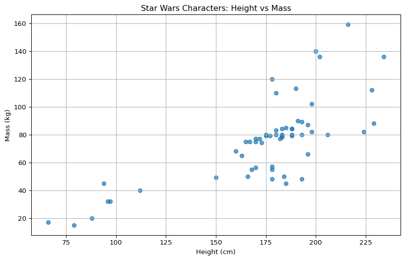
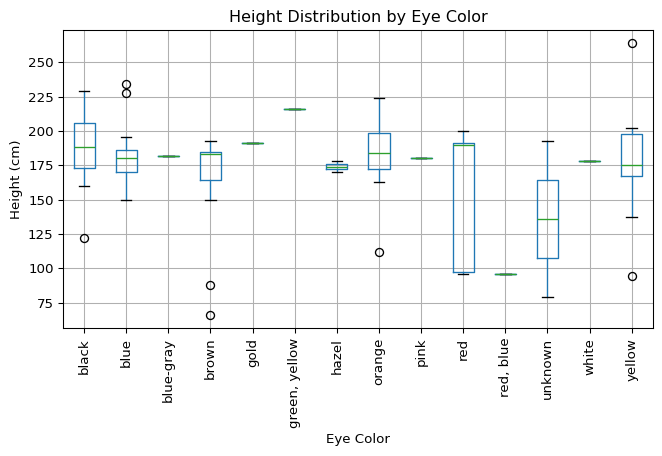

# Star Wars Character Analysis: Height and Mass


I wanted to look at all the Star Wars characters, so I got the .json
data from this free API. I wanted to analyze all of their heights and
weights to see if any specific characters tended to have similar traits.
Also, if any of the “good” characters had similar traits to the other
good characters, and if any of the “bad” characters had similar traits
to the other bad characters. I also wanted to see if there were any
outliers in the data, such as characters that were significantly taller
or heavier than the others.

``` python
import pandas as pd
import requests
import time

characters = "https://swapi.dev/api/people/"
all_people = []

while characters:
    r = requests.get(characters)
    data = r.json()

    if "results" not in data:
        raise ValueError(f"SWAPI response error: {data}")

    all_people.extend(data["results"])
    characters = data["next"]
    time.sleep(1)

people_df = pd.DataFrame(all_people)
people_df
```

<div>
<style scoped>
    .dataframe tbody tr th:only-of-type {
        vertical-align: middle;
    }
&#10;    .dataframe tbody tr th {
        vertical-align: top;
    }
&#10;    .dataframe thead th {
        text-align: right;
    }
</style>

|  | name | height | mass | hair_color | skin_color | eye_color | birth_year | gender | homeworld | films | species | vehicles | starships | created | edited | url |
|----|----|----|----|----|----|----|----|----|----|----|----|----|----|----|----|----|
| 0 | Luke Skywalker | 172 | 77 | blond | fair | blue | 19BBY | male | https://swapi.dev/api/planets/1/ | \[https://swapi.dev/api/films/1/, https://swapi... | \[\] | \[https://swapi.dev/api/vehicles/14/, https://s... | \[https://swapi.dev/api/starships/12/, https://... | 2014-12-09T13:50:51.644000Z | 2014-12-20T21:17:56.891000Z | https://swapi.dev/api/people/1/ |
| 1 | C-3PO | 167 | 75 | n/a | gold | yellow | 112BBY | n/a | https://swapi.dev/api/planets/1/ | \[https://swapi.dev/api/films/1/, https://swapi... | \[https://swapi.dev/api/species/2/\] | \[\] | \[\] | 2014-12-10T15:10:51.357000Z | 2014-12-20T21:17:50.309000Z | https://swapi.dev/api/people/2/ |
| 2 | R2-D2 | 96 | 32 | n/a | white, blue | red | 33BBY | n/a | https://swapi.dev/api/planets/8/ | \[https://swapi.dev/api/films/1/, https://swapi... | \[https://swapi.dev/api/species/2/\] | \[\] | \[\] | 2014-12-10T15:11:50.376000Z | 2014-12-20T21:17:50.311000Z | https://swapi.dev/api/people/3/ |
| 3 | Darth Vader | 202 | 136 | none | white | yellow | 41.9BBY | male | https://swapi.dev/api/planets/1/ | \[https://swapi.dev/api/films/1/, https://swapi... | \[\] | \[\] | \[https://swapi.dev/api/starships/13/\] | 2014-12-10T15:18:20.704000Z | 2014-12-20T21:17:50.313000Z | https://swapi.dev/api/people/4/ |
| 4 | Leia Organa | 150 | 49 | brown | light | brown | 19BBY | female | https://swapi.dev/api/planets/2/ | \[https://swapi.dev/api/films/1/, https://swapi... | \[\] | \[https://swapi.dev/api/vehicles/30/\] | \[\] | 2014-12-10T15:20:09.791000Z | 2014-12-20T21:17:50.315000Z | https://swapi.dev/api/people/5/ |
| ... | ... | ... | ... | ... | ... | ... | ... | ... | ... | ... | ... | ... | ... | ... | ... | ... |
| 77 | Grievous | 216 | 159 | none | brown, white | green, yellow | unknown | male | https://swapi.dev/api/planets/59/ | \[https://swapi.dev/api/films/6/\] | \[https://swapi.dev/api/species/36/\] | \[https://swapi.dev/api/vehicles/60/\] | \[https://swapi.dev/api/starships/74/\] | 2014-12-20T19:43:53.348000Z | 2014-12-20T21:17:50.488000Z | https://swapi.dev/api/people/79/ |
| 78 | Tarfful | 234 | 136 | brown | brown | blue | unknown | male | https://swapi.dev/api/planets/14/ | \[https://swapi.dev/api/films/6/\] | \[https://swapi.dev/api/species/3/\] | \[\] | \[\] | 2014-12-20T19:46:34.209000Z | 2014-12-20T21:17:50.491000Z | https://swapi.dev/api/people/80/ |
| 79 | Raymus Antilles | 188 | 79 | brown | light | brown | unknown | male | https://swapi.dev/api/planets/2/ | \[https://swapi.dev/api/films/1/, https://swapi... | \[\] | \[\] | \[\] | 2014-12-20T19:49:35.583000Z | 2014-12-20T21:17:50.493000Z | https://swapi.dev/api/people/81/ |
| 80 | Sly Moore | 178 | 48 | none | pale | white | unknown | female | https://swapi.dev/api/planets/60/ | \[https://swapi.dev/api/films/5/, https://swapi... | \[\] | \[\] | \[\] | 2014-12-20T20:18:37.619000Z | 2014-12-20T21:17:50.496000Z | https://swapi.dev/api/people/82/ |
| 81 | Tion Medon | 206 | 80 | none | grey | black | unknown | male | https://swapi.dev/api/planets/12/ | \[https://swapi.dev/api/films/6/\] | \[https://swapi.dev/api/species/37/\] | \[\] | \[\] | 2014-12-20T20:35:04.260000Z | 2014-12-20T21:17:50.498000Z | https://swapi.dev/api/people/83/ |

<p>82 rows × 16 columns</p>
</div>

``` python
people_df = people_df.loc[:, :"gender"]

people_df
```

<div>
<style scoped>
    .dataframe tbody tr th:only-of-type {
        vertical-align: middle;
    }
&#10;    .dataframe tbody tr th {
        vertical-align: top;
    }
&#10;    .dataframe thead th {
        text-align: right;
    }
</style>

|  | name | height | mass | hair_color | skin_color | eye_color | birth_year | gender |
|----|----|----|----|----|----|----|----|----|
| 0 | Luke Skywalker | 172 | 77 | blond | fair | blue | 19BBY | male |
| 1 | C-3PO | 167 | 75 | n/a | gold | yellow | 112BBY | n/a |
| 2 | R2-D2 | 96 | 32 | n/a | white, blue | red | 33BBY | n/a |
| 3 | Darth Vader | 202 | 136 | none | white | yellow | 41.9BBY | male |
| 4 | Leia Organa | 150 | 49 | brown | light | brown | 19BBY | female |
| ... | ... | ... | ... | ... | ... | ... | ... | ... |
| 77 | Grievous | 216 | 159 | none | brown, white | green, yellow | unknown | male |
| 78 | Tarfful | 234 | 136 | brown | brown | blue | unknown | male |
| 79 | Raymus Antilles | 188 | 79 | brown | light | brown | unknown | male |
| 80 | Sly Moore | 178 | 48 | none | pale | white | unknown | female |
| 81 | Tion Medon | 206 | 80 | none | grey | black | unknown | male |

<p>82 rows × 8 columns</p>
</div>

To do this I ran grabbed all the data from the .json and threw it into a
pandas DataFrame. I then filtered the DataFrame to only include the
columns that I was interested in analyzing, which were the name, height,
mass, and gender of the characters. This allowed me to focus on the
specific traits that I wanted to analyze.

``` python
people_df["height"] = pd.to_numeric(people_df["height"], errors="coerce")
people_df["mass"] = pd.to_numeric(people_df["mass"], errors="coerce")
```

    C:\Users\tyube\AppData\Local\Temp\ipykernel_14216\438440469.py:1: SettingWithCopyWarning:


    A value is trying to be set on a copy of a slice from a DataFrame.
    Try using .loc[row_indexer,col_indexer] = value instead

    See the caveats in the documentation: https://pandas.pydata.org/pandas-docs/stable/user_guide/indexing.html#returning-a-view-versus-a-copy

    C:\Users\tyube\AppData\Local\Temp\ipykernel_14216\438440469.py:2: SettingWithCopyWarning:


    A value is trying to be set on a copy of a slice from a DataFrame.
    Try using .loc[row_indexer,col_indexer] = value instead

    See the caveats in the documentation: https://pandas.pydata.org/pandas-docs/stable/user_guide/indexing.html#returning-a-view-versus-a-copy

``` python
people_df.describe()
```

<div>
<style scoped>
    .dataframe tbody tr th:only-of-type {
        vertical-align: middle;
    }
&#10;    .dataframe tbody tr th {
        vertical-align: top;
    }
&#10;    .dataframe thead th {
        text-align: right;
    }
</style>

|       | height     | mass       |
|-------|------------|------------|
| count | 81.000000  | 58.000000  |
| mean  | 174.604938 | 75.575862  |
| std   | 34.774157  | 29.252514  |
| min   | 66.000000  | 15.000000  |
| 25%   | 167.000000 | 55.300000  |
| 50%   | 180.000000 | 79.000000  |
| 75%   | 191.000000 | 84.000000  |
| max   | 264.000000 | 159.000000 |

</div>

``` python
import matplotlib.pyplot as plt
import matplotlib.ticker as mticker
import pandas as pd
people_df.boxplot(column=["height", "mass"])
plt.title("Star Wars Characters: Height and Mass")
plt.xlabel("Character Traits")
plt.ylabel("Values")
plt.show()
```


From the boxplot, we can see that there are some outliers in both height
and mass. The tallest character is significantly taller than the rest,
and the heaviest character is also significantly heavier than the rest.
This suggests that there may be some characters in the Star Wars
universe that have unique physical traits compared to the majority of
characters.

``` python
people_df.groupby("gender")[["height", "mass"]].mean()
```

<div>
<style scoped>
    .dataframe tbody tr th:only-of-type {
        vertical-align: middle;
    }
&#10;    .dataframe tbody tr th {
        vertical-align: top;
    }
&#10;    .dataframe thead th {
        text-align: right;
    }
</style>

|               | height     | mass       |
|---------------|------------|------------|
| gender        |            |            |
| female        | 166.647059 | 54.020000  |
| hermaphrodite | 175.000000 | NaN        |
| male          | 179.237288 | 81.004545  |
| n/a           | 120.000000 | 46.333333  |
| none          | 200.000000 | 140.000000 |

</div>

From the groupby analysis, we can see that on average, male characters
tend to be taller and heavier than female characters. This is consistent
with real world trends in human height and weight. Now, let’s look at
the characters height and weight in a scatter plot to visualize the
relationship between height and mass for each character.

``` python
plt.figure(figsize=(10, 6))
plt.scatter(people_df["height"], people_df["mass"], alpha=0.7)
plt.title("Star Wars Characters: Height vs Mass")
plt.xlabel("Height (cm)")
plt.ylabel("Mass (kg)")
plt.grid()
plt.show()
```



This is good now I want to add the names of the characters to the
scatter plot to see if there are any specific characters that stand out
in terms of their height and mass.

``` python
plt.figure(figsize=(10, 6))
plt.scatter(people_df["height"], people_df["mass"], alpha=0.7)
for i, name in enumerate(people_df["name"]):
    plt.text(people_df["height"][i], people_df["mass"][i], name, fontsize=8)
plt.title("Star Wars Characters: Height vs Mass with Names")
plt.xlabel("Height (cm)")
plt.ylabel("Mass (kg)")
plt.grid()
plt.show()
```


As you can see in the scatter plot a lot of the taller and heavier
characters tend to be bad characters such as Darth vader and Grevious.
Chewbacca is also up there in terms of height and weight, but this seems
to be an outlier as he is a good character. Overall, it seems that there
is a trend where the bad characters tend to be taller and heavier than
the good characters, but there are some exceptions to this trend. This
makes sense because a bad character is meant to be seen as intimidating
and powerful, which can be conveyed through their physical traits.

Next I wanted to look at the distribution of heights and weights based
on eye color given that eye color can be a significant trait in the Star
Wars universe, often associated with certain species or character types.

``` python
people_df.boxplot(column="height", by="eye_color")
plt.title("Height Distribution by Eye Color")
plt.xlabel("Eye Color")
plt.ylabel("Height (cm)")
plt.xticks(rotation=90)
plt.suptitle("")
plt.tight_layout()
plt.show()
```



``` python
import matplotlib.pyplot as plt

people_df.boxplot(column="mass", by="eye_color")
plt.title("Mass Distribution by Eye Color")
plt.xlabel("Eye Color")
plt.ylabel("Mass (kg)")
plt.xticks(rotation=90)
plt.suptitle("")
plt.tight_layout()
plt.show()
```


``` python
eye_color_stats = people_df.groupby("eye_color")[["height", "mass"]].mean()
eye_color_stats
```

<div>
<style scoped>
    .dataframe tbody tr th:only-of-type {
        vertical-align: middle;
    }
&#10;    .dataframe tbody tr th {
        vertical-align: top;
    }
&#10;    .dataframe thead th {
        text-align: right;
    }
</style>

|               | height     | mass       |
|---------------|------------|------------|
| eye_color     |            |            |
| black         | 185.000000 | 76.285714  |
| blue          | 182.210526 | 86.516667  |
| blue-gray     | 182.000000 | 77.000000  |
| brown         | 167.315789 | 66.092308  |
| gold          | 191.000000 | NaN        |
| green, yellow | 216.000000 | 159.000000 |
| hazel         | 174.000000 | 66.000000  |
| orange        | 180.500000 | 67.200000  |
| pink          | 180.000000 | NaN        |
| red           | 154.800000 | 81.400000  |
| red, blue     | 96.000000  | NaN        |
| unknown       | 136.000000 | 31.500000  |
| white         | 178.000000 | 48.000000  |
| yellow        | 177.818182 | 81.111111  |

</div>

From the boxplots and the groupby analysis, we can see that there are
some differences in height and mass based on eye color. For example,
characters with blue eyes tend to be taller on average than characters
with other eye colors. Additionally, characters with yellow eyes tend to
be heavier on average than characters with other eye colors. This
suggests that there might be a correlation between eye color and
physical traits. For example the characters with yelow eyes are often
either bad guys or droid characters which tend to be heavier than good
characters to be an intimidating presence. On the other hand, characters
with blue eyes are often good characters which tend to be taller than
bad characters to be seen as heroic and powerful. Overall, it seems that
eye color can be a significant trait in the Star Wars universe that is
associated with certain physical traits.
